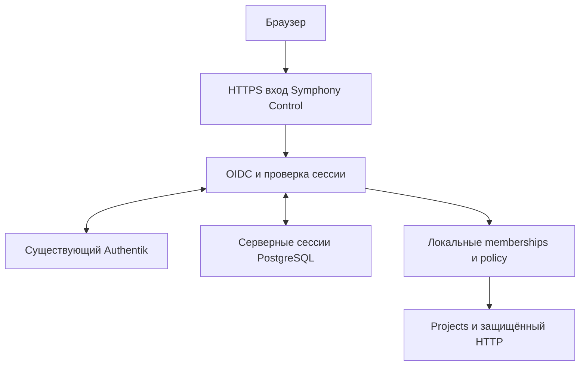

# Authentik: проверенная сессия и доступ к проекту

Дата: 2026-10-04. Статус: проект для review письменной спецификации.
Это дизайн следующего этапа, а не работающий SSO, scheduler admission или приёмка SN-005.

## Цель и исходное состояние

Пользователь входит через существующий Authentik и читает только проекты,
в которых у него есть явно назначенное локальное право. Один web client
обслуживает Symphony Control; client на каждый проект не создаётся.
Парольная база и Basic Auth как замена SSO отсутствуют.

Исходный принятый HEAD PR14: `f16c32764df584291d2bdf95d66a4ef9f57daf83`;
tree: `44fe878d0de0dc6a2402b23508f4beb742231bb0`;
base/main: `2bf21950e0725bc9228b262e1495f5af5eeea1d6`.
[GH74 принят](https://github.com/pupkinson/SymphonyNext/issues/74#issuecomment-5980076935):
protected check111437950577, 413 тестов/0 ошибок/6 существующих skips,
100% configured coverage, Dialyzer0, независимый READY без findings.

`SymphonyControl.Router` уже обслуживает отдельный opt-in IPv4 loopback listener.
`GET /api/v1/projects/:id` вызывает существующий Projects.get_project с
серверным current_actor и нормализованным UUID. Сейчас actor отсутствует
по умолчанию; доступ закрыт. UI на порту stock dashboard и этот control
компонент имеют разные назначения.

PR34 содержит принятый source-only Principal, без broad/protected acceptance.
PR38 содержит незакрытый malformed-input defect и ранее отказанное исправление.
Эта работа не импортирует эти ветки, не исправляет их и не повторяет
отказанную операцию через другой путь. История остаётся в соответствующих PR.

Каноническая SN-005 зависит от полной SN-004, остаётся planned/admitted=false.
Данный документ не меняет DAG, admission или состояние milestone.

## Источники и границы решения

База: SPECIFICATION v0.5 AUTH-01..09, SEC-01..08/10, INV-02/05,
ARCH-01/04/07, API-06; назначенная карточка SN-005 и правила PROJECT_RULES v0.5.
Полная композиция planning/spec-index.json проверена по SHA256;
MCP/browser identities остаются разными, MCP admission не создаётся.

| Источник | Проверенный SHA256 |
| --- | --- |
| SPECIFICATION.md | b107299574b8717e45d9fc58e8f204b37b441344c8c559e5e65a8113d10238a6 |
| TASKS.md | 4ddfbeabf36a43064bfc84c6385be2bb6bd4bb58441d09556651d660b710fa11 |
| planning/backlog.json | c2a0e1a51409bd82c4dda0c5195b60926d311a64098d28defd14842c9a77b4f0 |
| policies/project-policy.json | 831e8f86170211d2b800960c64ce977d7816167501fb9ec831bdbce702e097a9 |
| planning/spec-index.json | 172aa99da739bcbce48420754445e486ef364d340efac9dad20bc83a243a8153 |

Первичные внешние источники, прочитаны 2026-10-04:
- [Authentik OAuth2/OIDC provider](https://docs.goauthentik.io/add-secure-apps/providers/oauth2/):
  provider endpoints, issuer mode, PKCE и client configuration.
- [Authentik logout](https://docs.goauthentik.io/add-secure-apps/providers/oauth2/frontchannel_and_backchannel_logout/):
  RP должен реализовать logout endpoint; версия и доставка проверяются.
- [OIDC Core](https://openid.net/specs/openid-connect-core-1_0.html):
  code flow и обязательная проверка ID token.
- [RFC9700](https://www.rfc-editor.org/rfc/rfc9700.html): профиль защиты OAuth.
- [Oidcc3.9.0, документация разработчика](https://oidcc.hexdocs.pm/readme.html):
  кандидат протокольной библиотеки для Erlang/Elixir, поддерживает code/PKCE,
  discovery, JWKS, userinfo/introspection. Это наблюдаемая версия документации,
  не уже установленная зависимость или утверждение о совместимости.

Рекомендован прямой confidential OIDC client и server-side session.
Proxy headers не становятся источником actor. Собственная реализация
JWT signature/crypto primitives не выбирается. Зависимости и их
immutable версии проверяются и фиксируются отдельной реализационной частью;
библиотечная сертификация не заменяет тесты нашей интеграции.

## Состав и владение

Control хранит identities, sessions и local memberships. IdP аутентифицирует
человека и предоставляет проверяемые сведения о допустимости его сессии.
Project policy решает доступ к конкретному нормализованному project UUID.
Runner/agent не получает web cookie, token, DB credential или human role.

Планируемые владельцы в существующем приложении:
- Auth context: поиск связанного local user по точным issuer+subject,
  получение подтверждённой server session, типизированные безопасные ошибки.
- OIDC adapter/controller: начало flow, одноразовый callback и logout;
  только фиксированные runtime endpoints из проверенного operator manifest.
- Session store: expiry/revocation, одноразовые pending flows, session rotation,
  связанные ciphertext и события invalidation.
- HTTP authentication Plug: очищает actor assignment, получает opaque session
  из cookie и присваивает current_actor только после всех server checks.
- Project authorizer: действующий callback authorize(actor, action, scope),
  отдельный lookup текущей membership и явных platform permissions.

Это один control supervisor и существующий domain API; второй scheduler,
authentication proxy subsystem или самостоятельный agent не добавляются.

## OIDC вход

1. Оператор связывает собственные application/provider и confidential client,
   exact issuer/discovery/JWKS, allowed algorithms, external HTTPS origin,
   exact redirect/logout URIs и secret references. Host/query параметры
   запроса не меняют эти bindings. Discovery issuer сравнивается точно;
   предполагаемое совпадение issuer и URL discovery не используется.
2. Начало входа создаёт криптографически случайные state, nonce, PKCE verifier
   и отдельную browser binding. PKCE допускает только S256.
   Pending record живёт максимум300секунд, связан с браузером и одной конфигурацией.
3. Callback сверяет state/browser binding/expiry и атомарно потребляет pending
   flow перед token exchange. Повторный callback и параллельное употребление
   отклоняются. Неизвестный исход обмена не повторяет тот же authorization code:
   сессия не создаётся, нужен новый flow.
4. Adapter проверяет signature по разрешённому signing algorithm и JWKS,
   exact issuer, audience/client, authorized party при необходимости,
   expiry/time bounds, nonce и subject. Доверие к email, groups, superuser
   или произвольному role/project claim как к identity/правам исключено.
5. Local identity имеет UNIQUE(issuer,subject) и ссылку на local user UUID.
   Привязка по email не выполняется. Саморегистрация и автоматические
   memberships выключены; неразрешённая identity получает фиксированный отказ.
6. Session ID меняется при успешном входе. В браузер возвращается только
   opaque session handle; access/ID/refresh tokens туда не передаются.
   Callback немедленно перенаправляет на фиксированный локальный путь,
   без произвольного return_to. Transient authorization code не сохраняется
   в итоговом URL, audit или access logs; query/body/code/state редактируются
   до log storage и на разрешённом TLS ingress.
7. JWKS/discovery networking имеет operator-bound destinations,
   TLS validation, response-size/deadline limits и не следует произвольным
   redirect URL или jku/x5u из token. Неизвестный kid допускает один bounded
   refresh; отсутствие ключа после него даёт отказ.

Запрашиваются только openid/profile/email. offline_access и
goauthentik.io/api в первой части не запрашиваются. Секреты передаются
только через runtime references нового control, не через argv/git/artifact.
OIDC client работает в собственном process/UID boundary control;
совмещённый запуск с локальными агентами остаётся запрещён существующей
границей и требует отдельной production isolation acceptance.

## Серверная сессия и её хранение

Cookie: Secure, HttpOnly, SameSite=Lax, Path=/, без Domain; opaque handle
не короче32 случайных байт. Cookie с префиксом __Host- устанавливается
только за проверенным HTTPS ingress. Loopback HTTP fixture и product
cookies разделены; небезопасный cookie не является production fallback.

В DB хранится hash handle, local principal reference, exact issuer/subject
binding, IdP sid при его наличии, issued/expiry/revoked timestamps,
config generation и session generation. Начальный absolute lifetime
ограничен меньшим из3600секунд и срока допустимости выбранного IdP credential.
Продление не осуществляется простым чтением cookie или старого JWT.

Только необходимые для server freshness/logout tokens хранятся шифрованно
через reviewed encryption adapter с authenticated encryption и runtime
key reference вне DB. Session/config binding включаются в AAD.
При отсутствии/замене key, невозможности расшифровки, Repo failure или
неподтверждённой session всё закрывается; plaintext/log fallback отсутствует.

Restart не возрождает consumed pending flow или revoked session.
Clock rollback не продлевает expiry; monotonic freshness cache привязан
к текущему process epoch и после restart начинается как неподтверждённый.
DB uniqueness/foreign keys и поддерживаемый schema-health контракт
обновляются совместно с migrations в своей последующей source части.

## Права на проект

Для этой вертикали используются локальные memberships, а не автоматическое
IdP group-to-role mapping. Удаление локальной membership проверяется
сервером заново при каждом project read; старый browser/actor/role cache
не сохраняет разрешение. Membership содержит local user/project UUID,
явный набор ролей и revision/revocation state.

| Серверная роль | Чтение собственного разрешённого проекта | Чтение другого проекта | Runtime identity платформы |
| --- | --- | --- | --- |
| Viewer | Да при текущей membership | Нет | Только отдельный явный platform grant |
| Contributor | Да при текущей membership | Нет | Только отдельный явный platform grant |
| Operator | Да при текущей membership | Нет | Только отдельный явный platform grant |
| Approver | Да при текущей membership | Нет | Только отдельный явный platform grant |
| Project Admin | Да при текущей membership | Нет | Только отдельный явный platform grant |
| Platform Admin без membership | Нет | Нет | Только явный grant runtime_identity_read |
| Service/agent identity | Не через human web session | Нет | Не через human web session |

Roles не дают автоматически enqueue, approve, project creation или platform
permissions. Для этих действий нужны отдельные owning contracts.
AUTH-09 task-result acceptance отличается от protocol approvals и сейчас
не реализуется. Любое отсутствующее/повреждённое поле, неизвестная role/action,
lookup failure либо результат authorizer, отличный от ровно :ok, закрывает доступ.

IdP group может ограничивать доступ к самому приложению только через
проверенный binding нового application. Удаление из этой allowlist проверяется
отдельно от локальной membership. Group claim из старого token не подтверждает
актуальную eligible state, даже если cryptographic signature ещё валидна.

## Свежесть и отзыв:60секунд

Криптографически действующий JWT не доказывает текущую eligible state пользователя.
Session freshness и local membership freshness являются разными проверками.

Локальные sessions/memberships читаются непосредственно из серверной DB
для каждого protected operation. Подписанный back-channel logout отзывает
связанные sessions; RP logout немедленно отзывает локальную session до
попытки внешнего logout. Ошибка IdP logout не возвращает local access.

Для IdP user/app eligibility предлагается предельная давность
подтверждённого server observation50секунд, один networking deadline
не более5секунд и запрет использования старого success при ошибке.
Дата observation обновляется только после реального authoritative check,
а не после проверки signature, чтения cache или недоставленного события.
При неизвестной свежести запрос запрещён.

**Механизм live observation пока UNKNOWN.** Операторский readback точной
версии должен подтвердить, какие client-scoped standard endpoints/events
действительно обнаруживают deactivation, session revocation и app-group removal.
Наличие introspection/userinfo URL или back-channel опции этого не доказывает.
Ни wide admin API token, ни изменение global Authentik flows для решения
этого вопроса не разрешаются. Если механизм не обеспечивает доказанный предел,
live authentication не активируется и AC-22 остаётся BLOCKED.

Back-channel handler проверяет signed logout_token: signature/issuer/audience,
events, iat, replay-protected jti, отсутствие nonce и подходящий sid/sub.
Неверный/чужой logout не отзывает другую identity/session.
События дедуплицируются; их приемка не заявляется по одному HTTP200.

Будущий LiveView/WebSocket проверяет origin, session и права при событиях
и прекращает private subscriptions/data delivery до deadline. В первой
GET-вертикали LiveView/WS не добавляется; отсутствие этих assertions
не позволяет принять полную SN-005.

## HTTP контракт первой пользовательской вертикали

| Route | Назначение и допустимый источник |
| --- | --- |
| GET /auth/login | Новый server-bound OIDC flow; только проверенная конфигурация |
| GET /auth/callback | Одна browser-bound code response; state/nonce/PKCE и token validation |
| POST /auth/logout | Local revoke + RP logout; CSRF/origin/session checks |
| POST /auth/backchannel-logout | Только signed IdP logout, не browser/mutation cookie |
| GET /api/v1/projects/:id | Session-derived actor и текущая membership нормализованного UUID |
| GET /api/v1/control/identity | Отдельный явный runtime_identity_read platform permission |

Auth включается явно после целостной runtime configuration.
Отсутствующая конфигурация не устанавливает permissive authorizer:
существующий project route по-прежнему403 без actor.
Client actor_id, role, email, groups, project claim и tracker credentials
не могут создать или переопределить actor. Тестовый trust fixture не
устанавливается в production pipeline.

JSON проекта сохраняет schema_version1 и whitelist
id/key/name/lock_version/inserted_at/updated_at. Existing typed400/403/404/503
и no-store сохраняются. Protected errors и auth outcomes — фиксированные codes
без исходного token, code, identity или provider exception. Auth responses
и redirects также no-store; применяются bounded input и rate limits.
Новые mutation/list/tracker/dashboard endpoints не добавляются.

## Реализационные части после review дизайна

Это порядок следующего подробного плана, не уже исполненные или admitted задачи.

1. **Protocol/config adapter и fixture.** Проверить/pin библиотеку и зависимости.
   Реальный disposable OIDC provider/client в fixture; Code/S256,state,nonce,
   exact redirect, signature/issuer/audience/expiry, consumed-flow/replay,
   JWKS rotation/error и timeout assertions. Test-only endpoints не попадают
   в product configuration. RED должен быть продуктовой регрессией,
   setup failure не считается RED.
2. **Session/membership domain.** Owned migrations на real disposable PostgreSQL,
   local issuer+subject binding, opaque cookies, ciphertext, expiry/revocation,
   restart, roles/platform grants, read-only Projects authorization seam.
   Границы schema-health и секретов проверяются совместно.
3. **HTTP integration и freshness/logout.** Real loopback transport в fixture,
   server assignment, project GET и denied spoofed actor/cookie,
   local revoke, signed logout, cache/clock/restart fault cases.
   Неизвестная IdP eligible state закрывает доступ.
4. **Exact-version live acceptance.** Только новое application/provider
   и разрешённый новый HTTPS/control resource manifest. Реальная browser
   сессия плюс two-tab/group/session/user revocation и измеренный предел60секунд.
   Старые shared IdP providers/flows и DF Assistant не изменяются.

Каждая source часть имеет свой frozen ACCEPTED delta, один writer,
сохранённый лимит максимум2repair cycles/1profile change и конечный wall budget.
Подробный plan следует после review этой спецификации. Source-only READY,
fixture GREEN и реальный IdP/production acceptance фиксируются раздельно.

## Приёмка и отрицательные сценарии

| Группа | Проверяемый исход |
| --- | --- |
| Protocol | Wrong issuer/audience/signature/alg/nonce/state/redirect/expiry запрещены; unsigned и replay запрещены |
| Browser binding | Другой браузер, consumed/expired flow, parallel callback и session fixation не создают session |
| Local identity | Email collision не связывает аккаунты; неизвестный issuer/sub или inactive user закрыты |
| Roles | Project A не читает B; IdP superuser и platform grant не создают membership; service/agent не human |
| Malformed/fault | Missing fields, module failure, DB/IdP timeout и unknown lookup дают безопасный отказ, без KeyError/secret echo |
| Freshness |50секунд/60секунд, clock rollback и restart проверены; failed refresh не продлевает cached access |
| Revocation | Local membership, app-group removal, deactivated user и terminated IdP session отдельно закрывают две вкладки до60секунд |
| Logout | Local revoke немедленен; signed sid/sub logout, duplicate jti и чужие issuer/audience проверены |
| Persistence | Migrated DB/restart сохраняют revoked/consumed state, constraints и поддерживаемую readiness |
| Secret boundary | Cookie/token/client secret не появляются в argv/log/event/UI/artifact и не читаются агентом |
| Existing component | Health без приватной identity; project whitelist/no-store/errors и locked gates неизменны |

Targeted checks затем неизменённые build/format/lint/full test coverage100%/
Dialyzer gates, bootstrap/manifest/diff/PR-body checks. Для каждой команды
сохраняются UTC start/end/exit/source и hashes. Это будущие команды;
текущая document-only работа не исполняет и не объявляет их PASS.
Новый source HEAD требует собственного independent review/protected check;
green f16 не сертифицирует будущий auth commit.

## Требуемые operator facts

Файл bootstrap/RESOURCE_BINDINGS.json — historical snapshot:
new_application_configured=false, issuer_verified=false. Его поля не
являются свежим readback действующего Authentik. Коннектор Authentik
в доступных инструментах не обнаружен; URL/IDs/версии не угадывались.

До live-интеграции нужны следующие факты и проверяемые источники:
- exact installed Authentik version и URL собственного instance;
- новый application/provider stable IDs, confidential client_id и signing policy;
- exact issuer плюс отдельный discovery URL/JWKS и client-auth method;
- внешний HTTPS origin нового control и exact callback/post-logout/back-channel URIs;
- runtime client-secret/encryption-key references в новом контуре, только имена;
- локальные identity/membership bootstrap bindings и app eligibility allowlist;
- доступный механизм observation/invalidation без wide admin credential;
- разрешённые TLS/network routes, новый control identity/resource manifest,
  независимая runner/process isolation и ingress log redaction;
- реальный источник доказательств ≤60секунд для всех required revocation cases.

Secret values не публикуются и не запрашиваются в чат.
Фактическая настройка Authentik/HTTPS ресурсов выполняется отдельным
ограниченным operator interface в принятом resource scope.

## Самопроверка, status и rollback

VERIFIED: исходный f16/check/owner receipt и чистый source; canonical hashes;
существующий callback/default-deny HTTP; опубликованные GH33/PR34/38 ограничения;
первичные protocol/library/logout документы.
INFERRED: proposed50+5секунд оставляют запас внутри60секунд; это design bound,
не измеренное live SLO.
UNKNOWN: installed IdP/client/origin/eligible-state механика и production
schema/image/config/function readback.
BLOCKED: live SSO/AC-22/full SN-005, пока не закрыты prerequisite/resource/
freshness gates и не выполнены независимые реальные проверки.

Self-review: каждый интерфейс имеет владельца; identity не равна permission;
возраст JWT не равен IdP eligibility; проектные и platform permissions разделены;
все_UNKNOWN — внешние gates с указанным доказательством, не молчаливый fallback.
Проверены scope, неоднозначности, противоречия и необоснованные claims.
Документ не меняет canonical definitions, admission, CI policy или PR14 source.

До merge сохраняются свои worktree/evidence и предыдущие попытки.
После release rollback допустим только на подтверждённый schema-compatible
predecessor; такой production predecessor здесь UNKNOWN.
Новые sessions/memberships не восстанавливаются destructive DB rollback.
Следующий шаг: review письменной спецификации, затем подробный plan исполнения;
product code и IdP activation не начинаются этим document-only commit.
